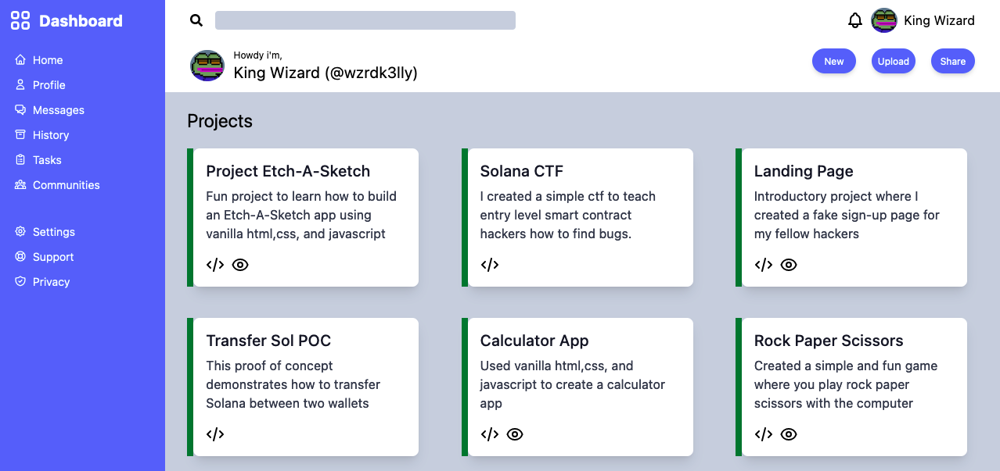

## Overview
I used Tailwindcss to create a dashboard themed webpage. The cards contains descriptions and links to a few of my personal projects.

## Lessons Learned
- The power of using both css-grid and css-flexbox together
- Advanced topics for css grid such as using `repeat()` and `fr` to make the layout more responsive 
- Tailwind css basics 

## Potential Improvements
- Add the ability to create, update, and delete cards

